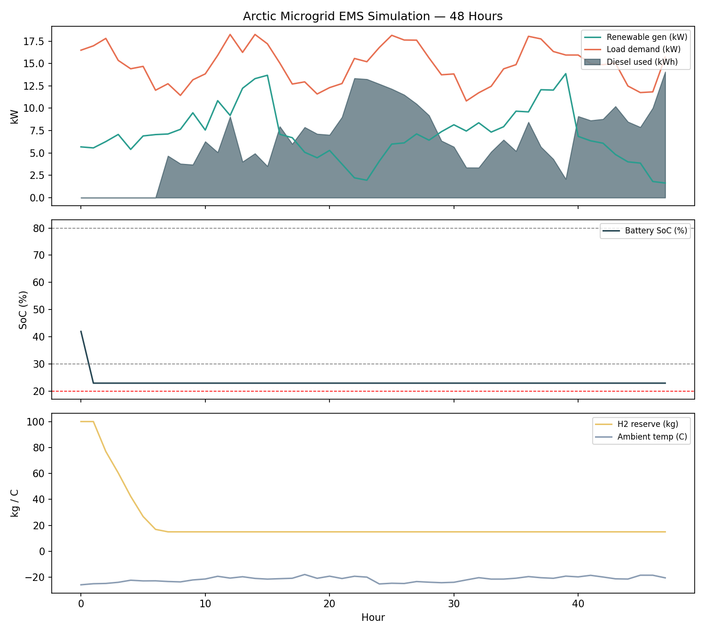

# Arctic Microgrid EMS — Decision Logic Simulation

A rule-based Energy Management System (EMS) simulation for an autonomous hybrid
microgrid (solar, wind, battery, hydrogen fuel cell, diesel backup) serving a
remote Arctic community. Built as part of a technical exercise on EMS design for
cold-climate, off-grid energy networks.

## Overview

Northern and remote communities often rely heavily on diesel generators, leading
to high costs, emissions, and limited energy independence. This project simulates
a rule-based EMS decision layer that prioritizes clean energy sources and falls
back to diesel only as a last resort — while explicitly accounting for reduced
battery performance in extreme cold.

**Priority order:** Renewables → Battery → Hydrogen fuel cell → Diesel generator

## What it does

- Simulates 48 hours of an Arctic winter scenario using synthetic but realistic data:
  solar generation (short winter daylight), wind generation, community load demand,
  and sub-zero ambient temperature
- Applies a simplified cold-climate battery derating model — usable capacity drops
  as temperature falls below -20°C
- Runs an hourly EMS decision loop implementing the priority chain above, including:
  - Charging the battery from renewable surplus
  - Routing excess renewable energy to hydrogen production (electrolysis) once the
    battery is full
  - Discharging the battery to cover shortfalls when safe to do so
  - Falling back to the hydrogen fuel cell when the battery alone can't cover demand
  - Starting the diesel generator only when renewables, battery, and hydrogen are
    all insufficient
- Tracks and plots battery State of Charge, hydrogen reserve, and diesel usage
  over the full simulation window

## Example results (48-hour Arctic winter run)

| Metric | Value |
|---|---|
| Total diesel energy used | 305.8 kWh |
| Hours diesel generator engaged | 41 / 48 |
| Final hydrogen reserve | 15.0 kg (started at 100 kg) |
| Minimum battery SoC reached | 23% |

Under this scenario, the EMS logic correctly protects the battery from
over-discharging and only escalates to diesel once renewables and hydrogen are
exhausted — but the results also show significant diesel dependency during a
harsh winter window, suggesting renewable capacity or hydrogen storage would need
to be sized accordingly for real deployment.



## Running it

```bash
pip install numpy matplotlib
python ems_simulation.py
```

This prints a summary of results and a sample decision log, and saves
`ems_simulation_result.png`.

## Scope and limitations

This is a proof-of-concept built to demonstrate the EMS decision logic working
end-to-end — not a validated engineering-grade simulation. In particular:

- Battery cold-weather derating uses a simplified linear approximation, not a full
  electrochemical model
- State of Charge is tracked directly rather than estimated from sensor data
- Hydrogen production/consumption efficiencies are simplified constants
- Load, weather, and generation data are synthetic, not measured field data

A natural next step would be integrating a learned State-of-Health / Remaining-
Useful-Life estimation layer (e.g. building on prior work using a hybrid
quantum-classical neural network for Li-ion battery SOH prediction) upstream of
this decision logic, and validating the control logic via hardware-in-the-loop
(HIL) simulation before any field deployment.

## Author

Md. Shahinur Rahman Chowdhury
[research.shahinur.dev](https://research.shahinur.dev)
